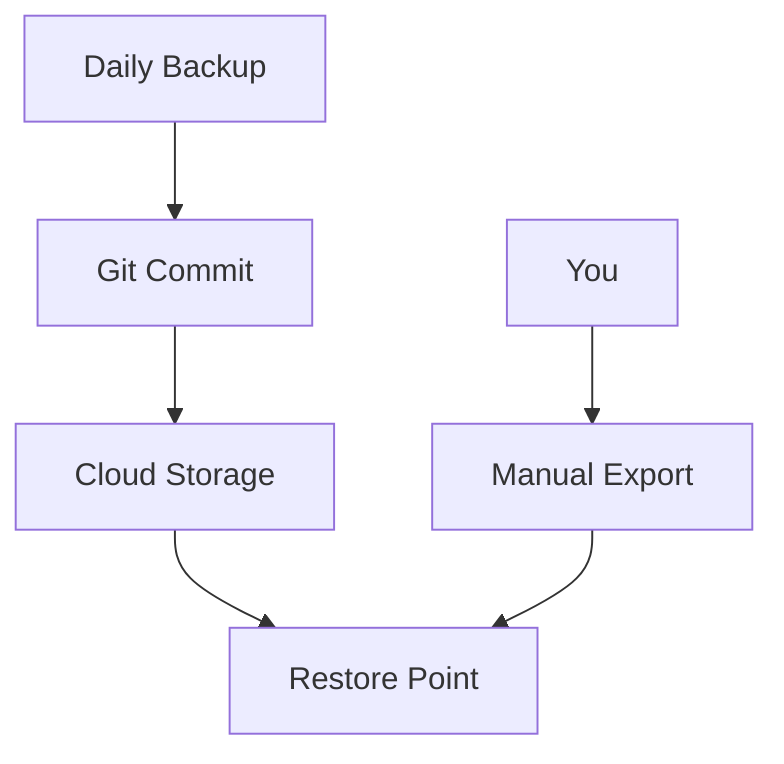

## Overview

Customize your Ragunathan N documentation space to match your brand and workflow. Set brand colors like `#3B82F6`, manage user access, add custom assets, and implement backups. Follow these guides to tailor everything precisely.

<Columns cols={2}>
  <Card title="Brand & Themes" icon="palette" href="#brand-themes">
    Update colors and styles quickly.
  </Card>
  <Card title="User Permissions" icon="users" href="#permissions">
    Control who edits and views docs.
  </Card>
  <Card title="Custom Assets" icon="image" href="#assets">
    Integrate logos and images.
  </Card>
  <Card title="Backup & Versioning" icon="git-branch" href="#backup">
    Secure your content history.
  </Card>
</Columns>

<Callout kind="tip">
  Start with brand colors for immediate visual impact. Save changes to see updates live.
</Callout>

## Setting Brand Colors and Themes

Update your space's appearance using the config file.

<Steps>
  <Step title="Access Config" icon="settings">
    Navigate to your space settings and open `config.json`.
  </Step>
  <Step title="Edit Brand Color" icon="palette">
    Set your primary color.

    <CodeGroup tabs="JSON,YAML">
```json
{
  "brand": {
    "color": "#3B82F6",
    "secondary": "#1D4ED8"
  }
}
```
```yaml
brand:
  color: "#3B82F6"
  secondary: "#1D4ED8"
```
    </CodeGroup>
  </Step>
  <Step title="Apply Theme" icon="save">
    Save and refresh. Themes propagate to all pages.
  </Step>
</Steps>

## Managing User Permissions

Define roles to secure your documentation.

| Role       | View | Edit | Admin | Description                  |
|------------|------|------|-------|------------------------------|
| Viewer     | ✅   | ❌   | ❌    | Read-only access             |
| Editor     | ✅   | ✅   | ❌    | Edit content, no settings    |
| Admin      | ✅   | ✅   | ✅    | Full control, user management|

<Tabs>
  <Tab title="Invite Users" icon="user-plus">
    Use the dashboard to add emails.

    ```bash
    ragunathan invite user@example.com --role=editor
    ```
  </Tab>
  <Tab title="CLI Permissions" icon="terminal">
    Set via command line.

    ```bash
    ragunathan permissions set user@example.com editor
    ragunathan permissions list
    ```
  </Tab>
</Tabs>

## Integrating Custom Assets

Upload logos, icons, and scripts.

<Steps>
  <Step title="Upload Assets" icon="upload">
    Go to Assets panel and drag files.
  </Step>
  <Step title="Reference in MDX" icon="code">
    Use relative paths.

````mdx
<Image
  src="/assets/logo.png"
  alt="Ragunathan N Logo"
  width="200"
  height="60"
/>
````
  </Step>
</Steps>

<Expandable title="Advanced Asset Config" default-open="false">
  Configure CDN integration in `config.json`:

```json
{
  "assets": {
    "cdn": "https://cdn.yourdomain.com",
    "cache": { "ttl": "1h" }
  }
}
```
</Expandable>

## Backup and Version Control

Protect your docs with automated backups.



<Callout kind="info">
  Enable Git integration for full version history. Run `ragunathan backup init` to start.
</Callout>

Use these settings for robust control:

<CodeGroup tabs="Git,Cloud">
```bash
# Git setup
git init docs/
ragunathan backup git --remote=origin
```
```bash
# Cloud backup
ragunathan backup cloud --provider=s3 --bucket=ragunathan-backups
```
</CodeGroup>